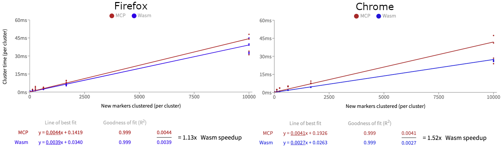
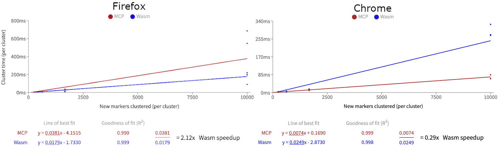
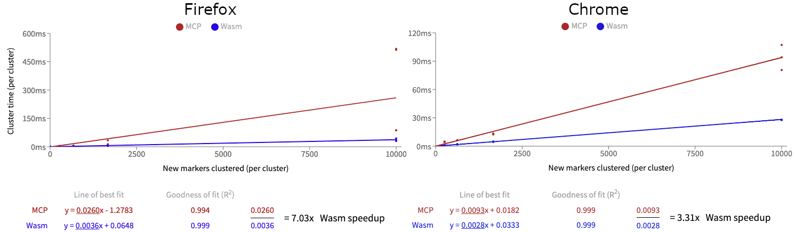

Sometimes you have a solution in search of a problem. WebAssembly has a lot of potential uses, but are any of them reasonable in the average modern web app?

If you're like me, you've heard that WebAssembly is a lot faster than JavaScript, but you haven't seen an apples-to-apples comparison of the two languages performing the same task. Maybe you know of cool Wasm usages like the new [Google Earth](https://earth.google.com), [Squoosh App](https://squoosh.app/), or [AutoCAD on the web](https://blogs.autodesk.com/autocad/autocad-web-app-google-io-2018/), but these are very special cases, far from the typical web applications that most developers work on.

In this article I take a piece of functionality from a real web app, port it to Wasm (compiled from Rust), and compare the results.

TLDR: In my opinion, if you're looking to get better performance from your webapp, in 95% of cases your time would be better spent doing more traditional performance analysis on bottlenecks, and not porting your code to Wasm.

## The Motivation

So what real world app examples can we use Wasm for? Well a while back I was working on real estate website for a client who needed to display a lot of home listings on a map. There were so many markers that they needed to be aggregated and displayed as clusters. We ended up using MarkerClustererPlus (MCP from here on) to do this. At the time, I thought this might be a perfect opportunity to use WebAssembly, for a few reasons:

- Clustering markers is a lot of math (calculating distances between lat/lng coordinates)
- This math could be isolated from code that manipulates the DOM
- The naive MCP clustering algorithm is expensive O(n^2)

However, the team didn't have the requisite knowledge, budget or time to implement this, so we stuck with MCP, and I shelved the idea.

In my spare time, I finally developed a library to do this, [wasm-marker-clusterer](https://github.com/stefan2718/wasm-marker-clusterer).

## The Results

Depending on the OS and browser, the Wasm implementation is approximately **10-50% faster** than the JS version, with some caveats, as I'll explain below. The precise results also depend on the the input, like the zoom, grid size and particular set of markers in the viewport. Here are examples from a few different cases:



## When to use Wasm
Wasm isn't going to replace JavaScript for the tasks that JavaScript was invented for: small user interactions, quick DOM manipulations and simple scripts. Wasm  _can_ be better at heavy processing, in that it offers developers more low-level control, but you lose the Javascript optimizations that browsers have been perfecting for decades, which makes it easy to shoot yourself in the foot.

## Shooting yourself in the foot

Before publishing, this article stated that the Wasm version was **5-15 times** faster than JavaScript (or 500-1500%). I then noticed that MCP had newer versions and I should probably use the latest version to be fair...

After upgrading, using Chrome, the new MCP version was faster than my Wasm version (although Wasm was still faster in Firefox). It came down to this [one fix](https://github.com/googlemaps/v3-utility-library/commit/6e736768cb7dd2f645cdaa8cb5684967b6bc78f8) that was completed after someone noticed that MCP was [rendering while it was clustering](https://github.com/googlemaps/v3-utility-library/issues/605).



So why was the Wasm port now slower? After profiling the code in Chrome, I could see that the `add_markers` method was eating up at least 50% of the CPU time. I discovered this was because the method would scan through all the markers in the cluster to see if it was already added. This is an unnecessary step because we're already tracking `is_added` for each marker at a higher level in the call stack. 


After removing that extra scan, Wasm was again much faster than MCP (5-10x in Firefox, ~3x in Chrome). 



However, this makes the comparison unfair, as the implementations have become algorithmically different - MCP [still checks all markers](https://github.com/googlemaps/v3-utility-library/blob/%40google/markerclustererplus%405.0.3/packages/markerclustererplus/src/cluster.ts#L127-L132) in a cluster before adding a new marker. It may or may not have a good reason to do so, I'm not clear on all the use cases.

```javascript
  function addMarker(marker) {
    if (this.isMarkerAlreadyAdded_(marker)) {
      return false;
    }
    ...
```

So to make the comparison fair, I removed that check from MCP and reran the comparison tests. Wasm comes out ahead still, but by a more reasonable margin, 1.1x in Firefox, and 1.5x in Chrome.


With the O(n^2) algorithm running, Chrome ran MCP consistently much faster than Wasm, and on Firefox MCP was inconsistently slower (and sometimes faster).
With the O(n) algorithm, Chrome and Firefox ran Wasm faster _on average_.

What does this even mean? 
Are the browsers supremely good at optimizing slow Javascript, and could be smarter about memory management? Whereas for Wasm, the browsers have fewer optimizations due to the lower instruction level, and newer memory management models? At this point, I don't know, and I'm not really sure I want to devote time to figuring it out.


## Lessons learned

### 1. Wasm runs on the main thread.

When I first learned about how Wasm modules are sandboxed, I presumed that meant that they don't run on the main thread. Even after I loaded my module, I thought it was running in another thread, because everything seemed so snappy still. It turns out that was just because Wasm is fast, and was quickly returning results before I could notice any unresponsiveness. It wasn't until I accidentally ran the **dev** compiled Wasm module instead of the **prod** compiled one that I noticed the page was unresponsive while waiting for results.

As it is, Wasm modules need to be loaded in Web Workers in order to run off the main thread. This isn't very difficult though because the sandboxed nature of Wasm modules make them easy to slot into a Web Worker without having to remove DOM manipulation code.

### 2. It's important to consider the Wasm/JS boundary

In an early iteration [(v0.0.4)](https://github.com/stefan2718/wasm-marker-clusterer/blob/v0.0.4/src/lib.rs) of wasm-marker-clusterer, I was passing in _all_ the markers every time I wanted to calculate clusters. It turned out that serializing all the data in took almost 10x more time than clustering it once it was in Wasm. So instead I only serialized the markers once, and stored them on the Wasm side.

Similarly, serializing data back to JS takes time as well. Comparing MCP vs Wasm, I noticed that Wasm performed worse when just panning the map a small amount. Because this didn't require any additional clusters to be calculated, MCP already had the results, but the Wasm version still needed to serialize the existing clusters back to JS, so it was slower. In the next iteration [(v0.0.9)](https://github.com/stefan2718/wasm-marker-clusterer/blob/v0.1.0/js/index.ts) I fixed this by adding a JS wrapper to the Wasm module so it could store the previously calculated clusters on the JS side and only serialize them when they are modified.

### 3. Webpack can't load Wasm synchronously _(yet)_

When I created this library (Oct-Dec 2019), Wasm could not be loaded synchronously using Webpack. This led to some challenges bundling the package in an easily consumable way.

In order to make the package simple to install and use, I wanted to abstract the Wasm modules async load by wrapping it in a regular promise. With this strategy, a developer would bundle a small JS wrapper that is loaded synchronously with that relevant code, and this wrapper would handle loading the Wasm module.

However, Webpack v4 can't do this in a way that other Webpack apps can consume (see [issue #7843](https://github.com/webpack/webpack/issues/7843) and [issue 6818](https://github.com/webpack/webpack/issues/6818)). It also wouldn't allow you to just output one bundle to be loaded async that would include your Wasm module. If you tried, you'd get this error:

> WebAssembly module is included in initial chunk.
> This is not allowed, because WebAssembly download and compilation must happen asynchronous.
> Add an async splitpoint (i. e. import()) somewhere between your entrypoint and the WebAssembly module

Webpack v5 is [supposed to be able to do this.](https://github.com/webpack/webpack/issues/6615#issuecomment-576280946) But it seemed like there was no way to use v4 to bundle my Wasm module for other Webpack apps to use, so I had resigned myself to exporting the code without a bundler (which worked! You don't always need a bundler, see [v0.1.3](https://github.com/stefan2718/wasm-marker-clusterer/tree/v0.1.3))

So it was, until I decided to load the Wasm module inside a Web Worker. Using [GoogleChromeLabs/worker-plugin](https://github.com/GoogleChromeLabs/worker-plugin) did some Webpack magic that made it possible to do exactly what I wanted: abstract the async load of the Wasm module behind a standard promise. This is why `worker-plugin` is a peer dependency of the library. However, if a library user doesn't want to use Webpack, it should still work because the library still loads the Worker using the standard `new Worker("./worker")` constructor, as long as it can find and load the `"./worker"` file.

## Conclusion

Wasm does indeed offer some performance benefits over Javascript written to do the same thing. However, for the majority of projects, the development time to port code to Wasm and the expertise needed to code it to be performant make the decision difficult to justify.

To me, the more useful case for Wasm is to move existing libraries from other languages to the web. That's without mentioning usages of Wasm outside of a browser runtime.

Of course, your mileage may vary. You may have a case where it makes sense to port to Wasm. Thinking back to the real estate website that inspired this work, it was definitely the right decision to stick with MCP. Trying to develop a Wasm solution would've put us behind on deadlines and over-budget. If we had done a more standard performance analysis of bottlenecks in clustering, we may have found and fixed the rending-while-clustering bug in MCP that I mentioned above, which caused slowdowns on the site. Such an analysis would be a lot quicker to complete, and easier to implement a fix for compared to a Wasm solution.

## Other articles I will write

- How to easily put your Wasm module in a Web Worker
- How to automate Wasm unit tests with Cypress